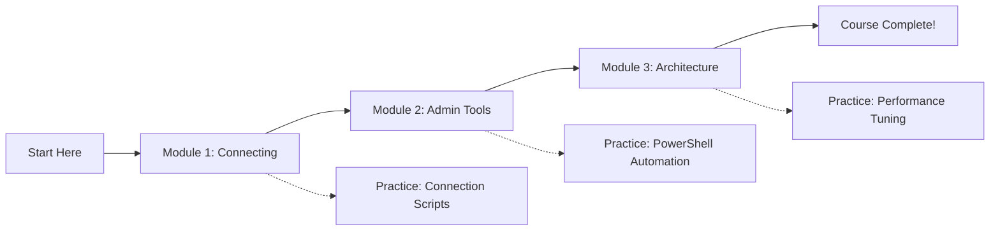

# Getting Started with SQL Server Administration


## 🎯 Course Overview

Welcome to the official repository for **"Getting Started with SQL Server Administration"** on Pluralsight! This entry-level course teaches you how to connect to, explore, and manage SQL Server instances using real-world tools and practical scenarios.

**Duration:** ~45 minutes | **Level:** Entry-Level | **Author:** [Tim Warner](https://TechTrainerTim.com)

### 📚 What You'll Learn

- ✅ **Connect** to SQL Server using SSMS and VS Code
- ✅ **Execute** essential T-SQL commands for database administration
- ✅ **Navigate** server architecture and manage database objects
- ✅ **Automate** tasks with PowerShell and command-line tools
- ✅ **Understand** SQL Server components and internal architecture

## 🗂️ Repository Structure

```
📦 getting-started-sql-server/
│
├── 📄 README.md                              # You are here!
├── 📄 getting-started-sql-server-exercise-files.md  # Course exercise guide
├── 📄 LICENSE                                # MIT License
│
├── 📁 module-1-connecting/                  # Module 1: Connecting & Exploring
│   ├── 📄 README.md                         # Module overview & learning objectives
│   ├── 📄 M1-Demo-Runbook.md               # Step-by-step demo guide
│   ├── 📄 module-1-demo-runbook.md         # Additional demo instructions
│   ├── 📁 demos/                           # 13 demo files
│   │   ├── 🔧 SQL connection scripts
│   │   ├── 📝 Configuration examples
│   │   └── 💻 VS Code workspace files
│   └── 📁 scripts/                         # PowerShell automation (if any)
│
├── 📁 module-2-admin-tools/                 # Module 2: Administration Tools
│   ├── 📄 README.md                         # Module overview & objectives
│   ├── 📄 M2-Demo-Runbook.md               # Detailed demo walkthrough
│   ├── 📄 module2_demo_runbook.md          # Additional instructions
│   ├── 📁 demos/                           # 6 SQL demo files
│   │   ├── 🏥 Health check scripts
│   │   └── 📊 Query examples
│   └── 📁 scripts/                         # 4 automation scripts
│       ├── 🔧 PowerShell examples
│       └── 💻 Command-line tools
│
├── 📁 module-3-architecture/                # Module 3: Architecture & Components
│   ├── 📄 README.md                         # Module overview & objectives
│   ├── 📄 M3-Demo-Runbook.md               # Architecture exploration guide
│   ├── 📄 README-Bonus.md                  # Bonus content & tips
│   ├── 📁 demos/                           # 10 analysis scripts
│   │   ├── 🔍 Performance queries
│   │   ├── 📈 Size analysis tools
│   │   └── 🗄️ File/filegroup management
│   └── 📁 scripts/                         # Additional automation
│
└── 📁 course-materials/                     # Supporting Materials
    ├── 📁 slides/                           # PowerPoint presentations
    │   ├── 📊 Module 1 slides (.pptx)
    │   ├── 📊 Module 2 slides (.pptx)
    │   └── 📊 Module 3 slides (.pptx)
    ├── 📁 docs/                             # Documentation
    │   ├── 📝 Course outline (.docx/.md)
    │   ├── 📝 Learning path (.docx/.md)
    │   └── 📝 Module summaries (.md)
    └── 📁 reference/                        # Quick references
        └── 🔗 Links and resources (.md)
```

## 🚀 Quick Start Guide

### Prerequisites

Before starting this course, ensure you have:

| Component | Version | Download Link |
|-----------|---------|--------------|
| **SQL Server** | 2022 Developer Edition | [Download](https://www.microsoft.com/en-us/sql-server/sql-server-downloads) |
| **SSMS** | 20.x (latest) | [Download](https://docs.microsoft.com/en-us/sql/ssms/download-sql-server-management-studio-ssms) |
| **VS Code** | Latest stable | [Download](https://code.visualstudio.com/) |
| **MSSQL Extension** | Latest | [Install in VS Code](https://marketplace.visualstudio.com/items?itemName=ms-mssql.mssql) |
| **PowerShell** | 7.x Core | [Download](https://github.com/PowerShell/PowerShell/releases) |
| **Windows** | 10/11 or Server 2019+ | - |

### Installation Steps

1. **Clone this repository:**
   ```bash
   git clone https://github.com/timothywarner-org/getting-started-sql-server.git
   cd getting-started-sql-server
   ```

2. **Install SQL Server 2022 Developer Edition**
   - Run the installer with default settings
   - Enable Mixed Mode authentication
   - Note your `sa` password

3. **Install required tools:**
   - SQL Server Management Studio (SSMS)
   - Visual Studio Code with MSSQL extension
   - PowerShell 7 (if not already installed)

4. **Verify installation:**
   ```powershell
   # Check SQL Server service
   Get-Service MSSQLSERVER
   
   # Test connection
   sqlcmd -S localhost -Q "SELECT @@VERSION"
   ```

## 📖 Module Navigation

### [Module 1: Connecting to and Exploring SQL Server](./module-1-connecting/)
Learn multiple ways to connect to SQL Server and explore its structure.

**Key Topics:**
- SSMS and VS Code connections
- Basic T-SQL operations
- Object Explorer navigation
- Configuration Manager basics

**Featured Demos:**
- `smoke-test.sql` - Quick connectivity verification
- `admin_sandbox.sql` - Safe practice environment
- `VSCode-mssql-connection-profile.json` - Connection configuration

---

### [Module 2: Using Core SQL Server Administration Tools](./module-2-admin-tools/)
Master the essential tools every SQL Server administrator needs.

**Key Topics:**
- PowerShell automation with SqlServer module
- sqlcmd command-line operations
- DBATools for advanced administration
- Health check implementation

**Featured Scripts:**
- `dbatools_example.ps1` - DBATools automation
- `run-healthcheck.ps1` - Automated health monitoring
- `sqlcmd_example.cmd` - Command-line administration

---

### [Module 3: Understanding SQL Server Architecture](./module-3-architecture/)
Dive deep into SQL Server's internal architecture and components.

**Key Topics:**
- Database Engine internals
- Files, filegroups, and transaction logs
- Pages and extents
- Performance analysis

**Featured Queries:**
- `m3-inspect-engine.sql` - Engine configuration analysis
- `top-databases-by-size.sql` - Storage analysis
- `m3-index-physical-stats-wwi.sql` - Index health assessment

## 🎓 Learning Path



## 💡 Pro Tips for Success

### 🏆 Best Practices
- **Always backup** before making changes
- **Use transactions** for data modifications
- **Test in development** before production
- **Document your changes** thoroughly

### 🛠️ Recommended Learning Approach
1. **Watch** the Pluralsight video for each module
2. **Read** the module's README and runbook
3. **Execute** the demo scripts step-by-step
4. **Modify** scripts to experiment and learn
5. **Practice** with your own scenarios

### ⚠️ Common Pitfalls to Avoid
- Don't run scripts without understanding them
- Always verify your server/database context
- Check permissions before executing admin commands
- Never store passwords in plain text scripts

## 🔧 Troubleshooting

### Connection Issues
```sql
-- Check SQL Server is running
EXEC xp_servicecontrol 'querystate', 'MSSQLSERVER'

-- Verify TCP/IP is enabled
-- Use SQL Server Configuration Manager
```

### Permission Errors
```sql
-- Check your current permissions
SELECT * FROM fn_my_permissions(NULL, 'SERVER')
```

### PowerShell Module Issues
```powershell
# Install required modules
Install-Module -Name SqlServer -Force
Install-Module -Name dbatools -Force

# Import modules
Import-Module SqlServer
Import-Module dbatools
```

## 📚 Additional Resources

### Official Documentation
- 📖 [SQL Server 2022 Documentation](https://docs.microsoft.com/en-us/sql/sql-server/)
- 🔧 [SSMS User Guide](https://docs.microsoft.com/en-us/sql/ssms/)
- 💻 [PowerShell SqlServer Module](https://docs.microsoft.com/en-us/powershell/module/sqlserver/)

### Community Resources
- 🌐 [SQL Server Central](https://www.sqlservercentral.com/)
- 👥 [r/SQLServer Reddit](https://www.reddit.com/r/SQLServer/)
- 💬 [SQL Server Community Slack](https://sqlcommunity.slack.com/)

### Tim's Resources
- 🌐 [TechTrainerTim.com](https://TechTrainerTim.com)
- 🐦 [Twitter/X: @TechTrainerTim](https://twitter.com/TechTrainerTim)
- 💼 [LinkedIn](https://www.linkedin.com/in/timothywarner/)

## 🤝 Contributing

Contributions are welcome! If you find issues or have improvements:

1. Fork the repository
2. Create a feature branch (`git checkout -b feature/AmazingFeature`)
3. Commit your changes (`git commit -m 'Add some AmazingFeature'`)
4. Push to the branch (`git push origin feature/AmazingFeature`)
5. Open a Pull Request

## 📝 License

This project is licensed under the MIT License - see the [LICENSE](LICENSE) file for details.

## 🙏 Acknowledgments

- **Pluralsight** for the platform and opportunity
- **Microsoft** for SQL Server and excellent documentation
- **The SQL Server Community** for continuous learning and support
- **You** for taking this course and advancing your career!

## 📬 Contact & Support

**Tim Warner**  
📧 Contact via [TechTrainerTim.com](https://TechTrainerTim.com)  
🐛 Issues: [GitHub Issues](https://github.com/timothywarner-org/getting-started-sql-server/issues)  
💡 Discussions: Use the Pluralsight course Q&A forum

---

### 🎯 Your Journey Starts Here!

> *"The expert in anything was once a beginner."* - Helen Hayes

Welcome to the world of SQL Server administration. Let's build something amazing together!

---

*Last Updated: August 2025 | Version 1.0 | Made with ❤️ by Tim Warner*